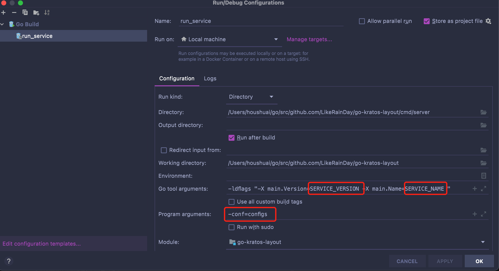

# 初次拉取
> 初次从模版工程项目拉取后，需要执行如下命令。
```shell

git submodule init
git submodule update

# 下载代码依赖
make all

```


# 项目启动

## IDEA
IDE 加载 `.run/run_service.run.xml`文件 如图所示


**注意:** 需要修改
1. SERVICE_NAME  表示服务名
2. SERVICE_VERSION 表示服务版本
3. `-config=configs` 表示配置文件路径

## Vscode
[.vscode/launch.json 配置方式](https://code.visualstudio.com/docs/editor/debugging#_launch-configurations)
```json
{
  "version": "0.2.0",
  "configurations": [
    {
      "name": "kratos run",
      "type": "go",
      "request": "launch",
      "mode": "debug",
      "program": "${workspaceFolder}/cmd/server",
      "cwd": "${workspaceFolder}",
      "env": {},
      "args": [],
      "showLog": true
    }
  ]
}
```

# 移除submodule

```
git submodule deinit submodulename
git rm submodulename
git rm --cached submodulename
rm -rf .git/modules/submodulename
```